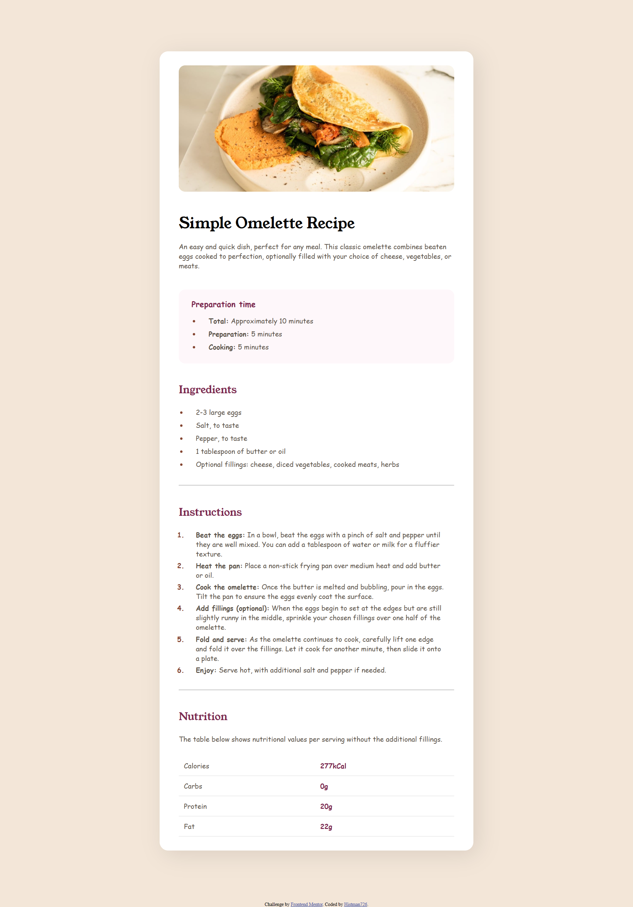

# Frontend Mentor - Recipe page solution

This is a solution to the [Recipe page challenge on Frontend Mentor](https://www.frontendmentor.io/challenges/recipe-page-KiTsR8QQKm). Frontend Mentor challenges help you improve your coding skills by building realistic projects. 

## Table of contents

- [Overview](#overview)
  - [The challenge](#the-challenge)
  - [Screenshot](#screenshot)
  - [Links](#links)
- [My process](#my-process)
  - [Built with](#built-with)
  - [What I learned](#what-i-learned)
- [Author](#author)

## Overview

### The challenge
Your challenge is to build out this recipe page and get it looking as close to the design as possible.

### Screenshot



### Links

- Solution URL: [Solution URL here](https://www.frontendmentor.io/solutions/recipe-page-main-flexbox-WNCfsAvl00)
- Live Site URL: [Live site URL here](https://animated-mooncake-819f20.netlify.app/)

## My process

### Built with

- Semantic HTML5 markup
- CSS custom properties
- Flexbox

### What I learned

I learned how to style li and ul tags as well as tables.

```html
<ol>
  <li><strong>Beat the eggs:</strong> In a bowl, beat the eggs with a pinch of salt and pepper until they are well mixed.
    You can add a tablespoon of water or milk for a fluffier texture.</li>
  <li><strong>Heat the pan:</strong> Place a non-stick frying pan over medium heat and add butter or oil.</li>
  <li><strong>Cook the omelette:</strong> Once the butter is melted and bubbling, pour in the eggs. Tilt the pan to ensure
    the eggs evenly coat the surface.</li>
  <li><strong>Add fillings (optional):</strong> When the eggs begin to set at the edges but are still slightly runny in the
    middle, sprinkle your chosen fillings over one half of the omelette.</li>
  <li><strong>Fold and serve:</strong> As the omelette continues to cook, carefully lift one edge and fold it over the
    fillings. Let it cook for another minute, then slide it onto a plate.</li>
  <li><strong>Enjoy:</strong> Serve hot, with additional salt and pepper if needed.</li>
</ol>
```
```css
ul li::marker, ol li::marker{
  color: var(--nutmeg);
  font-weight: bold;
  font-size: 16px;
}

.preparation ul, .ingredients ul, .instructions ol{
  padding: 0 20px;
}

.preparation ul li, .ingredients ul li, .instructions ol li{
  padding-left: 20px;
  padding-bottom: 8px;
}
```

## Author

- Website - [animated-mooncake](https://animated-mooncake-819f20.netlify.app/)
- Frontend Mentor - [@Histman726](https://www.frontendmentor.io/profile/Histman726)
